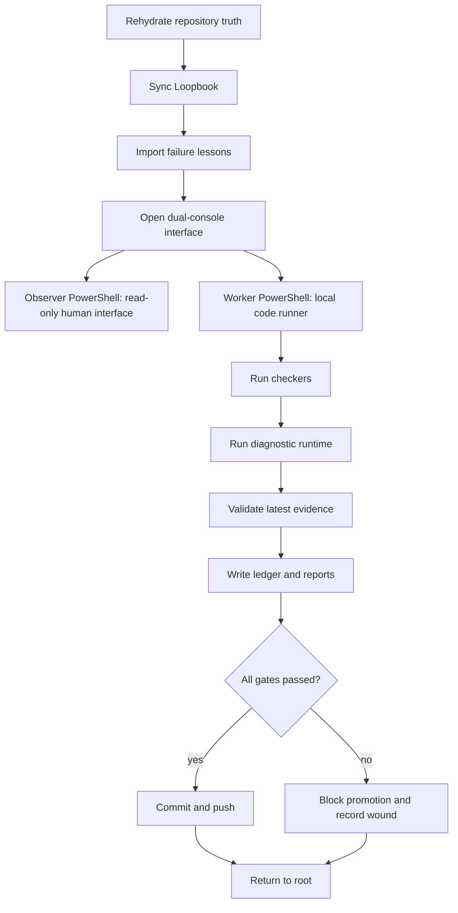

# TESSERA Operator Loop Chart

## ASCII Runtime Chart

```text
+--------------------------------------------------------------------------------+
|                          TESSERA OPERATOR LOOP                                  |
+--------------------------------------------------------------------------------+
| 01 REHYDRATE  | load README / AGENTS / RCC / origin / claim locks              |
| 02 LOOPBOOK   | sync canonical runbook + manifest                              |
| 03 LESSONS    | import failure lessons + README feature lessons                 |
| 04 LAUNCH     | open Observer + Worker PowerShell windows                       |
| 05 OBSERVE    | human-facing dashboard watches phase state                       |
| 06 WORKER     | worker runs commands, gates, runtime, validation                 |
| 07 CHECK      | RCC / architecture / README / loopbook / lessons / unit tests    |
| 08 RUN        | local diagnostic Tessera runtime                                 |
| 09 VALIDATE   | latest evidence + certificate validation                         |
| 10 LEDGER     | reports, lessons, live state, hashes                             |
| 11 PUSH       | commit + push after validation passes                            |
| 12 ROOT       | RootMirror returns to repository root                             |
+--------------------------------------------------------------------------------+
```

## Mermaid Chart



## Gate Law

```text
No feature promotion without Loopbook sync.
No Loopbook promotion without failure lessons chart.
No chart promotion without README visibility.
No validation pass, no durable continuation.
```